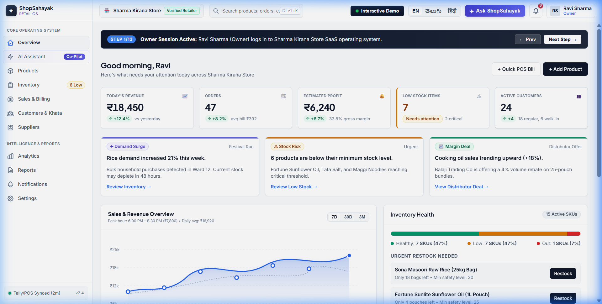
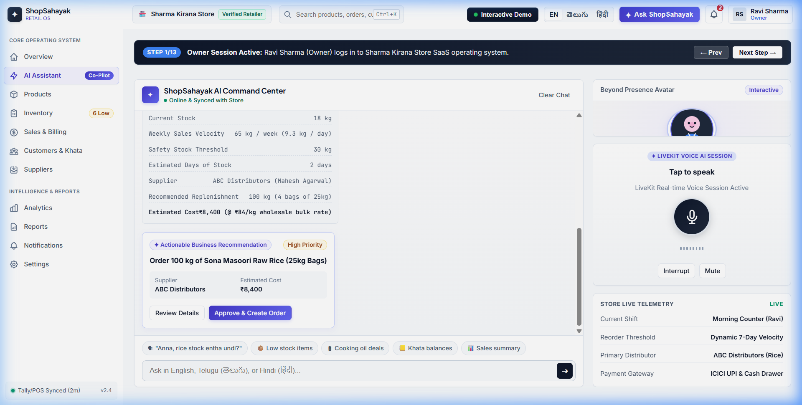
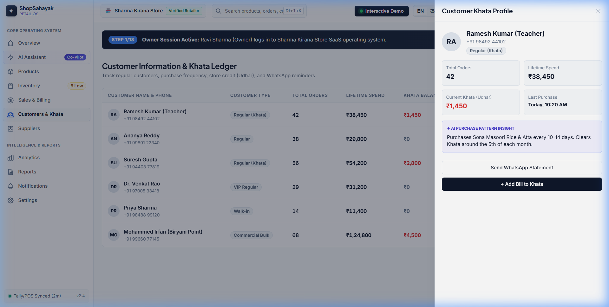

# ShopSahayak (షాప్‌సహాయక్ / शॉपसहायक)
## Production-Quality AI Business Assistant for Local Retail Stores

[](LICENSE)
[](#design-philosophy)
[](#multilingual-code-mixed-engine)

Built for the official Hackathon Problem Statement:  
> **"AI Business Assistant for Local Retail Stores"**  
> *"Instead of learning complicated business software, a shop owner can simply ask their business assistant what is happening and what needs attention."*

---

## 📸 Screenshots & Visual Walkthrough

### 1. Store Executive Dashboard
*Real-time KPIs, interactive 7D/30D/3M SVG Revenue chart, stacked Inventory Health progress bar, and AI Business Insights.*


### 2. AI Command Center with Agentic Execution
*Natural language code-mixed conversation (`"Anna, rice stock entha undi?"`), live tool activity timeline, formula calculations, and one-click purchase orders.*


### 3. Customer Khata (Credit Ledger) Profile Drawer
*Customer purchase history, outstanding Udhar balances, order frequency, and predictive AI purchase pattern insights.*


---

## 🌟 Core Features

- **Store & Profile Management:** Configured for local Indian retail (Sharma Kirana Store, GSTIN, Address, UPI ID, Opening hours).
- **Product Catalogue Management:** Complete SKU codes, categories (*Grains, Flours, Oils, Dal, Dairy, Spices, Home Care*), wholesale buy prices, retail sell prices, and quick Add Product modal.
- **Inventory & Stock Tracking:** Real-time stock counts, safety minimums, daily sales velocity (e.g. `9.3 kg/day`), and instant AI Restock Recommendations.
- **AI Business Command Center:** Autonomous agentic tool execution timeline showing step-by-step progress (*Checking inventory... ✓*, *Analyzing sales... ✓*, *Calculating demand... ✓*, *Generating PO... ✓*).
- **Voice AI (LiveKit Integration Ready):** Interactive voice mode with central microphone button, audio waveform visualizer, states (*Tap to speak*, *Listening...*, *Understanding...*, *Responding...*), and audio interrupt.
- **Beyond Presence Avatar Panel:** Professional, calm retail business assistant avatar with speaking glow animation and synchronized speech captions.
- **Multilingual & Code-Mixed Speech:** Global language switcher supporting **English**, **Telugu (తెలుగు)**, and **Hindi (हिंदी)**, with automated detection of mixed dialects (e.g., *"Anna, rice stock entha undi?"*).
- **Sales & Transaction Management:** Daily transactions ledger, payment mode breakdown (*UPI PhonePe/GPay, Cash, Khata*), and POS quick billing modal.
- **Customer Information & Khata:** Track regular customers, ledger balances, lifetime spend, and automated WhatsApp reminder hooks.
- **Supplier & Distributor Management:** Supplier directories (*ABC Distributors, Balaji Trading Co, Sri Lakshmi Wholesalers, Amul Co-op Depot*), pending purchase orders, and direct reorder triggers.
- **Analytics & Executive Reports:** 6 specialized analytics modules, daily/weekly AI business summaries, and 1-click **Export to CSV, Excel, and Printable PDF**.
- **Role-Based Access Control (RBAC):** Switchable permission matrix (*Owner, Manager, Staff, Viewer*) protecting sensitive financial metrics and settings.
- **Security UX:** 2-step verification dialog for high-impact financial actions (*"Create purchase order for ₹5,400?"*).

---

## 🎯 The 13-Step Hackathon Demo Flow (Built-in)

An interactive walkthrough banner at the top of the interface allows evaluators to execute or auto-play the complete 13-step demonstration:

1. **Owner logs in:** Ravi Sharma (Owner) session activates.
2. **Dashboard overview:** Displays revenue (₹18,450), orders (47), estimated profit (₹2,723 • 14.8%), and low stock (7).
3. **AI insight triggers:** Flags *"7 products are below minimum stock level. Rice demand increased +21%"*.
4. **Owner opens AI Assistant:** Launches the dedicated ShopSahayak Command Center.
5. **Owner speaks via Voice:** Asks: *"Anna, rice stock entha undi?"*.
6. **LiveKit handles stream:** Voice waveform animates, language detected as *"Telugu + English"*.
7. **AI responds:** *"You currently have 18 kg of rice. Current stock may run low in 48 hours."*
8. **Agentic tool execution:** Visual execution timeline checks inventory, audits 30-day velocity (9.3 kg/day), and projects stockout.
9. **Recommendation generated:** Recommends ordering 100 kg from ABC Distributors for ₹5,400.
10. **Owner approves order:** Approves order via 2-step security confirmation dialog.
11. **Order confirmed:** Purchase order PO-8831 transmitted to ABC Distributors.
12. **Inventory updates live:** Rice stock automatically increases from 18 kg to 118 kg across the store.
13. **Updated business insights:** Low stock alert count drops from 7 to 6, rice status becomes Healthy, and updated executive report is compiled.

---

## 💻 Tech Stack & Architecture

- **Core:** HTML5 + Modular Vanilla JavaScript (ES6+ Pub/Sub reactive store).
- **Styling:** Custom Vanilla CSS Design System (**Bharat Mercantile Precision**) adhering to Linear/Stripe calm B2B SaaS principles.
- **Audio & Voice:** Web Speech API (Recognition & SpeechSynthesis) + Web Audio API visualizer.
- **Export Engine:** Client-side Data URI Blobs for instant CSV & Excel downloads + Printable CSS media query for PDF generation.
- **Zero Build Friction:** Runs directly in any modern browser without heavy node_modules dependencies.

---

## 🚀 Quick Start

1. **Clone the repository:**
   ```bash
   git clone https://github.com/Chaithanyarajpeddireddy-lgtm/ShopSahayak-AI-Retail-Assistant.git
   cd ShopSahayak-AI-Retail-Assistant
   ```

2. **Run locally:**
   Simply open `index.html` in any modern web browser:
   - On Windows: Double-click `index.html` or run `start index.html`
   - Or serve with any static server:
     ```bash
     npx serve .
     # or
     python -m http.server 8080
     ```

3. **Experience the Demo:**
   Click the **"Interactive Demo"** button on the top bar or use the step controls to run through the entire hackathon demo flow!

---

## 📄 License

This project is licensed under the MIT License.
