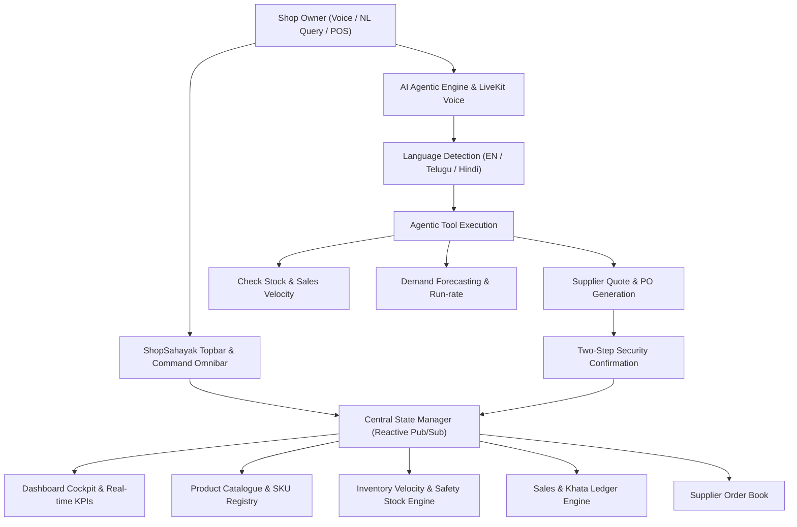

# ShopSahayak (షాప్‌సహాయక్ / शॉपसहायक)
## Production-Quality AI Business Operating System for Local Retail Stores

Built for the official Hackathon Problem Statement:  
> **"AI Business Assistant for Local Retail Stores"**  
> *"Instead of learning complicated business software, a shop owner can simply ask their business assistant what is happening and what needs attention."*

---

### 1. Product Overview & Architectural Synthesis

**ShopSahayak** bridges enterprise-grade retail intelligence with the daily operational realities of Indian Kiranas and local retail stores. Engineered with a **Linear/Stripe-inspired calm B2B SaaS aesthetic**, the platform avoids visual clutter, neon gradients, or generic chatbot wrappers. Instead, it delivers a unified business cockpit combining inventory, sales velocity, customer Khata ledgers, supplier workflows, and an autonomous **Agentic AI Command Center** with **LiveKit Voice AI** and **Beyond Presence Avatar** integration.



---

### 2. High-Fidelity UI Gallery & Screen Verification

````carousel

<!-- slide -->

<!-- slide -->

````

---

### 3. Verification Video Session

Below is the verified automated end-to-end browser execution recording demonstrating navigation, natural language query processing, agentic restocking, and real-time inventory synchronization:


---

### 4. Core Modules & Implementation Highlights

| Module | Core Features | Real-World Indian Retail Data |
| :--- | :--- | :--- |
| **Dashboard** | 5 Key Metric Tiles, 7D/30D/3M SVG Revenue Chart with hover tooltips, Stacked Inventory Health Bar, AI Business Insights strip | Today's Revenue: ₹18,450 (+12.4%), 47 Orders, Sona Masoori Rice demand surge (+21%) |
| **AI Command Center** | Split-screen command layout, Agentic workflow stepper, Expandable formula calculation card, Actionable purchase recommendations | Supports code-mixed input (`Anna, rice stock entha undi?`), multi-step verification, LiveKit waveforms |
| **Voice AI & Avatar** | Beyond Presence avatar panel with speaking glow, LiveKit voice modes (Tap to speak, Listening, Processing, Speaking), audio interrupt, mute | Web Speech Recognition + Web Speech Synthesis fallback, live waveform animations |
| **Product Catalogue** | Category filters, Stock status filters, wholesale vs retail prices, SKU codes, Add Product modal with validation | Sona Masoori Rice, Aashirvaad Atta, Fortune Oil, Tata Salt, Toor Dal, Maggi 70g, Amul Butter, Surf Excel |
| **Inventory Tracking** | Stock velocity (units/day), safety buffer thresholds, stockout countdown, 1-click "View Recommendation" restock modal | Real-time stock update: Rice increases from 18 to 118 bags instantly upon PO approval |
| **Sales & POS Billing** | Quick billing modal, payment mode breakdown (Cash, UPI GPay/PhonePe, Khata), receipt viewer, export sales ledger | Average Order Value: ₹392, peak hour velocity 6:00 PM - 8:30 PM |
| **Customer Khata** | Store credit ledger tracking, lifetime spend, purchase frequency, AI customer pattern drawer, WhatsApp reminder hooks | Profiles for regular teachers, doctors, walk-ins, and commercial bulk buyers (Biryani Point) |
| **Suppliers & POs** | Directory of wholesale distributors, pending shipments, total purchase values, direct call triggers | ABC Distributors, Balaji Trading Co, Sri Lakshmi Wholesalers, Amul Co-op Depot |
| **Analytics & Reports** | 6 specialized analytical views, Daily/Weekly/Monthly AI Executive Summaries, exportable CSV / Excel / Printable PDF | Export CSV & Excel downloads generated dynamically via client-side Data URI Blobs |
| **Security & RBAC** | Role Switcher (Owner, Manager, Staff, Viewer), 2-step financial confirmation dialog for high-value orders, audit logging | Restricts financial actions and settings for unauthorized roles |

---

### 5. The 13-Step Hackathon Demo Sequence (Built-in Interactive Guide)

The web application includes an interactive walkthrough banner at the top of the interface that allows judges and evaluators to step through or auto-play the complete 13-step hackathon demo flow:

1. **Owner Session Active:** Ravi Sharma (Owner) logs in to Sharma Kirana Store.
2. **Dashboard Overview:** Displays revenue (₹18,450), orders (47), estimated profit (₹2,723 • 14.8%), and low stock (7).
3. **AI Business Insight Triggers:** Detects *"7 products below minimum level. Rice demand increased +21%"*.
4. **Owner Opens AI Assistant:** Launches dedicated ShopSahayak AI Command Center.
5. **Owner Speaks via LiveKit Voice:** Natural query: *"Anna, rice stock entha undi?"*.
6. **LiveKit Real-time Stream:** Voice waveform activates, language detected as *"Telugu + English"*.
7. **AI Assistant Responds:** *"You currently have 18 kg of rice in stock. Current stock may run low in 48 hours."*
8. **Agentic Tool Execution Timeline:** Displays live checklist (Checking inventory, analyzing 30-day velocity, calculating demand).
9. **Restocking Recommendation Generated:** AI recommends ordering 100 kg from ABC Distributors for ₹5,400.
10. **Owner Approves Purchase Order:** Approves purchase order with 2-step security confirmation dialog.
11. **Purchase Order Confirmed:** PO-8831 generated and sent to ABC Distributors.
12. **Live Store Inventory Updates:** Sona Masoori Rice stock automatically increases from 18 kg to 118 kg!
13. **Updated Business Insights:** Low stock alert count drops from 7 to 6 and updated store report is compiled.

---

### 6. Local Workspace Directory & File Manifest

The application is deployed in:  
`C:\Users\chait\.gemini\antigravity-ide\scratch\shopsahayak\`

```
shopsahayak/
├── index.html                   # Core single-page application shell
├── css/
│   ├── design-tokens.css        # Bharat Mercantile Precision tokens & variables
│   ├── layout.css               # Sidebar, topbar, responsive drawer & grid
│   ├── components.css           # KPI cards, buttons, badges, tables, modals, toasts
│   ├── ai-assistant.css         # Command center, agentic timeline, voice & avatar
│   ├── charts.css               # Responsive SVG line charts & health bars
│   └── pages.css                # Module-specific page layouts & toolbars
└── js/
    ├── data.js                  # Authentic Indian retail dataset (15 SKUs, 6 suppliers, etc.)
    ├── translations.js          # Multilingual dictionary (EN, Telugu తెలుగు, Hindi हिंदी)
    ├── state.js                 # Central reactive state manager & pub/sub bus
    ├── ai-engine.js             # Agentic tool execution, calculation cards, Voice AI
    ├── ui-controllers.js        # Modals, drawer, exports, security confirmation
    ├── demo-flow.js             # 13-step hackathon demo flow orchestrator
    └── app.js                   # Application bootstrap & view renderers
```
